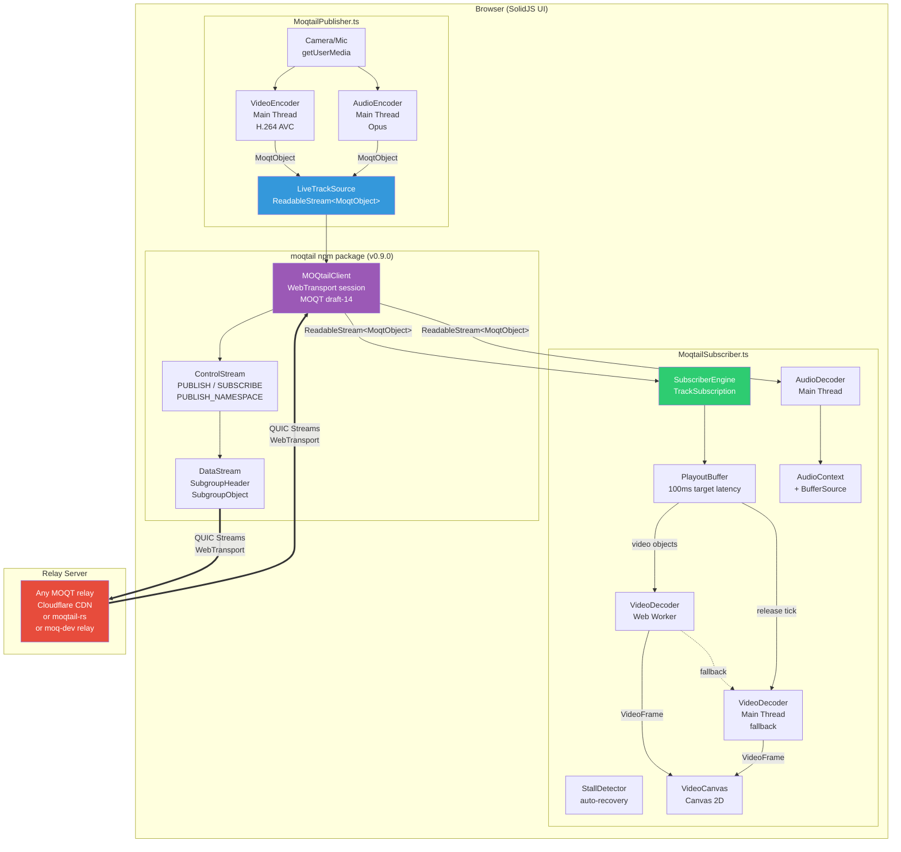
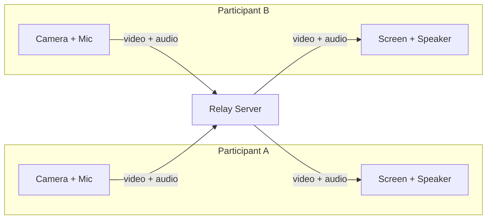
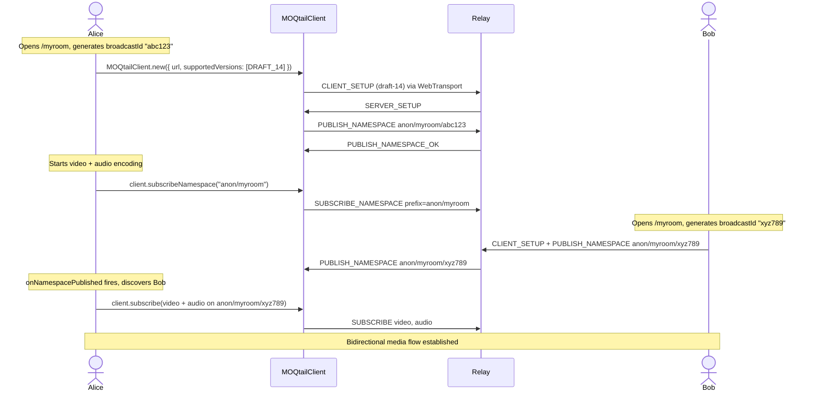
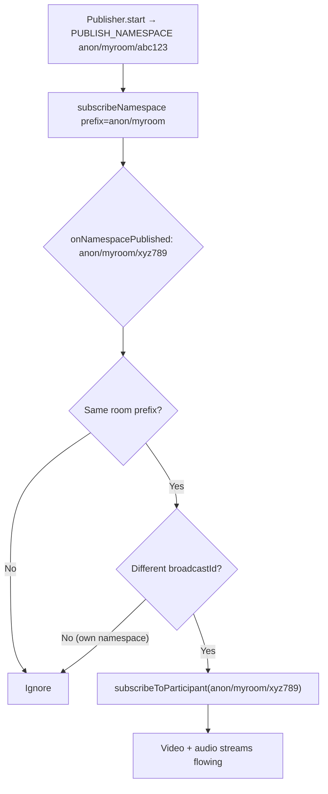
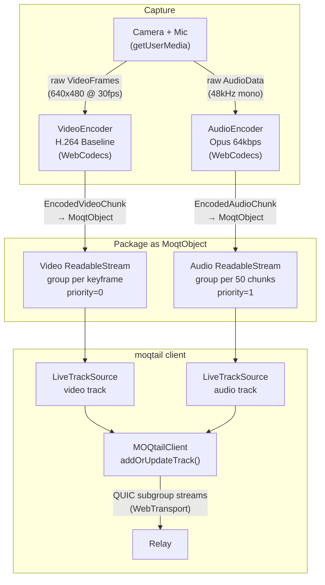
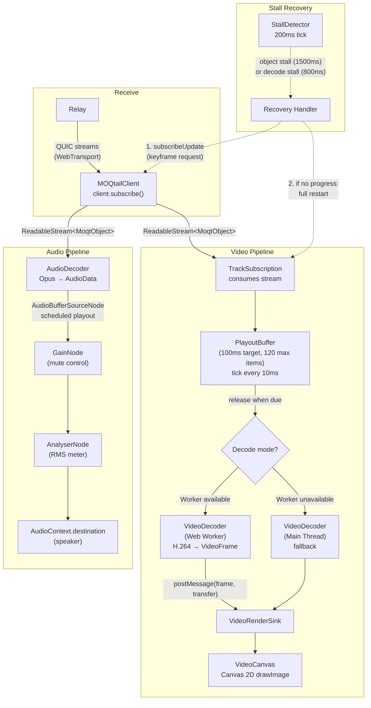
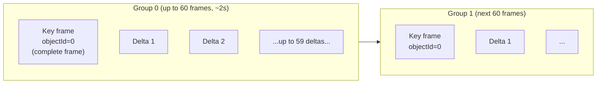
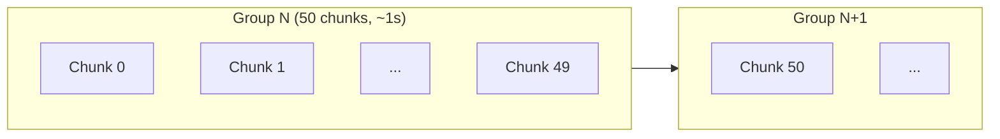
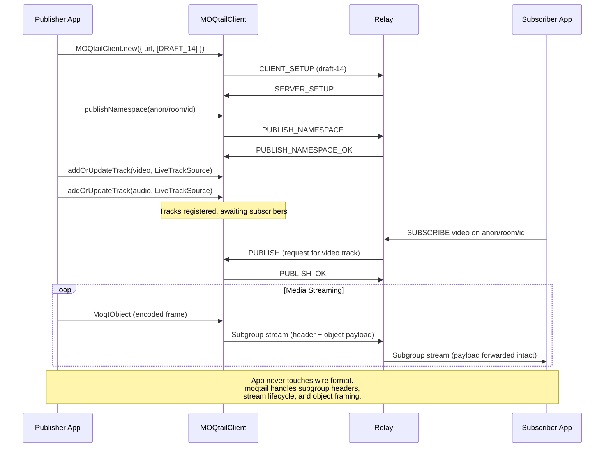
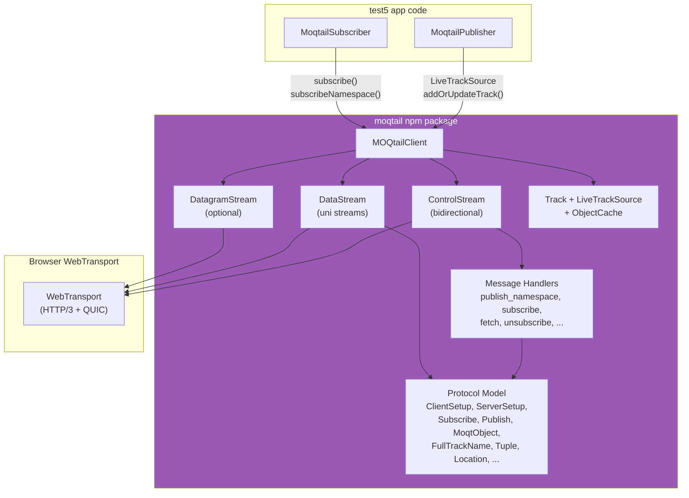

# moq-test5-moqtail

## Architecture



### How it works

1. **Publisher** captures camera/mic via `getUserMedia`, encodes with WebCodecs (H.264 + Opus), wraps each encoded chunk as a `MoqtObject`, and hands it to the `moqtail` client via `LiveTrackSource`
2. **moqtail client** handles all MOQT protocol details: WebTransport session setup, `PUBLISH_NAMESPACE`, subgroup framing, stream multiplexing -- the app never touches wire format
3. **Relay** receives published tracks and fans out to all subscribers. Compatible with any draft-14 relay (Cloudflare CDN, moqtail-rs, moq-dev)
4. **Subscriber** uses `subscribeNamespace` to discover remote participants, subscribes to their video/audio tracks, receives `MoqtObject` streams, decodes with WebCodecs, and renders to canvas + AudioContext

## Comparison with test2 (facebook-encoder)

| Aspect | test2 (facebook-encoder) | test5 (moqtail) |
|--------|--------------------------|-----------------|
| **Protocol layer** | Hand-written MOQT in JS (`moqt.js`, `mi_packager.js`) | `moqtail` npm package handles everything |
| **Encoding** | Workers: `v_capture.js` + `v_encoder.js` + `a_capture.js` + `a_encoder.js` | Main-thread `VideoEncoder` + `AudioEncoder` |
| **Sending** | Dedicated `moq_sender.js` worker writes QUIC streams directly | `LiveTrackSource` wraps a `ReadableStream<MoqtObject>`, library writes streams |
| **Receiving** | `moq_demuxer_downloader.js` worker reads QUIC streams + parses MOQMI framing | `client.subscribe()` returns `ReadableStream<MoqtObject>` already parsed |
| **Video decode** | `VideoDecoder` on main thread | Web Worker with main-thread fallback |
| **Audio playback** | `SharedArrayBuffer` circular buffer + `AudioWorklet` | `AudioContext.createBufferSource()` with scheduled playout |
| **Jitter/buffering** | 300ms jitter buffer per track (custom) | `PlayoutBuffer` with 100ms target latency + `StallDetector` auto-recovery |
| **Stall recovery** | Manual (user must refresh) | Automatic: keyframe request via `subscribeUpdate`, then full restart fallback |
| **Participant discovery** | `localStorage` shared broadcastId or URL room name | `subscribeNamespace` prefix matching via relay announcements |
| **Connection model** | Separate encoder/player WebTransport sessions | Single `MOQtailClient` for both publish and subscribe |
| **Wire format** | MOQMI extensions embedded in MOQT subgroup headers | Standard MOQT subgroup objects (no custom extensions) |
| **Lines of protocol code** | ~2000 (moqt.js + mi_packager.js + moq_sender.js + moq_demuxer_downloader.js) | 0 (all in npm package) |

## Room / Video Call



Each participant publishes their media to the relay and subscribes to the other's streams. The relay forwards without decoding or processing the media content.

### Join sequence



### Participant discovery

Each participant publishes under a unique namespace:

```
anon/{roomName}/{broadcastId}
```

The app calls `subscribeNamespace` with prefix `anon/{roomName}`. When the relay forwards a `PUBLISH_NAMESPACE` announcement from another participant, the `onNamespacePublished` callback fires and the subscriber auto-subscribes to their video and audio tracks.



## Media pipeline

### Encoder pipeline (send)



1. **Capture** -- `getUserMedia` provides raw video frames and audio samples on the main thread.

2. **Encode** -- WebCodecs compresses the raw media:
   - **Video**: H.264 Baseline (`avc1.42001f`), 640x480 @ 30fps, 1 Mbps, `annexb` format. Key frames forced every 60 frames (~2s). Each keyframe starts a new MOQT group.
   - **Audio**: Opus at 64kbps, 48kHz mono. Chunks are grouped into batches of 50 (~1 second per group).

3. **Package** -- Each encoded chunk is wrapped in a `MoqtObject` with location (group, object), priority, and forwarding preference (`Subgroup`). Video gets priority 0 (highest), audio gets priority 1.

4. **Send** -- The `LiveTrackSource` wraps the `ReadableStream<MoqtObject>` and is registered with `client.addOrUpdateTrack()`. The moqtail library handles subgroup framing and QUIC stream management automatically.

### Subscriber pipeline (receive)



4. **Receive** -- `client.subscribe()` returns a `ReadableStream<MoqtObject>` with objects already parsed from QUIC streams. No manual wire-format parsing needed.

5. **Playout buffer** -- Video objects enter a `PlayoutBuffer` (100ms target latency, max 120 items, 10ms tick). Objects are sorted by location (group, object) and released when their scheduled playout time arrives. Overflow drops oldest objects; late arrivals (already-released locations) are rejected.

6. **Decode** -- WebCodecs decompresses the media:
   - Video: First attempts `VideoDecoder` in a dedicated Web Worker. If the worker fails to initialize (e.g., `VideoDecoder` not available in worker context), falls back to main-thread decoder. Decoded `VideoFrame`s are transferred back via `postMessage` with `Transferable`.
   - Audio: `AudioDecoder` on main thread. Decoded `AudioData` is converted to `AudioBuffer` and played via scheduled `AudioBufferSourceNode` with 50ms initial delay.

7. **Render** -- Decoded frames are presented:
   - Video: drawn to a `<canvas>` element via `ctx.drawImage(frame)`. Local preview is horizontally flipped.
   - Audio: Routed through `GainNode` (speaker mute control) → `AnalyserNode` (RMS metering) → `AudioContext.destination`.

8. **Stall detection and recovery** -- A `StallDetector` checks every 200ms for:
   - **Object stall** (1500ms no new objects): likely network issue → request keyframe, then restart subscription
   - **Decode stall** (800ms no decoded frames while objects are arriving): likely decoder stuck → reset decoder, request keyframe via `subscribeUpdate`, wait 1s for progress, then restart if no improvement
   - Rate-limited: max 3 recoveries per 30s window, minimum 3s between attempts

## Video key frames and grouping



- **Key frames** are forced every 60 frames (~2s at 30fps). Each starts a new MOQT group (`groupId++`, `objectId=0`).
- **Delta frames** increment `objectId` within the current group.
- The `PlayoutBuffer` treats `objectId === 0` as a key frame for decode ordering.

## Audio grouping



- Opus produces chunks at ~20ms intervals.
- Every 50 chunks (~1 second), `groupId` increments and `objectId` resets.
- All audio chunks are encoded as key frames (Opus is inherently a low-delay codec).

## Wire format



## File structure

```
src/
  App.tsx                          # SolidJS router (single route → Test5)
  pages/Test5.tsx                  # Main page: wires publisher + subscriber + UI
  scenarios/
    MoqtailPublisher.ts            # Camera/mic capture → WebCodecs encode → moqtail publish
    MoqtailSubscriber.ts           # Namespace discovery → subscribe → decode → render
  media/subscriber/
    SubscriberEngine.ts            # Manages TrackSubscription lifecycle
    TrackSubscription.ts           # Per-track: subscribe, playout buffer, decode, stall recovery
    PlayoutBuffer.ts               # Time-based release queue with overflow/late drop
    StallDetector.ts               # Periodic health check with auto-recovery triggers
    types.ts                       # FrameObject, DecodedFrame, Worker message types
  workers/
    subscriberVideoDecodeWorker.ts # Dedicated VideoDecoder in Web Worker
  hooks/useTestSession.ts          # Room state, relay URL, join/leave lifecycle
  components/
    TestShell.tsx                   # Layout wrapper
    TestControls.tsx                # Relay URL, room name, join/leave controls
  VideoCanvas.tsx                  # Canvas renderer for VideoFrame
  DebugPanel.tsx                   # Diagnostics: connection status, RMS, event log
  helpers.ts                       # URL normalization, relay URL persistence
  types.ts                         # DiagEvent, RemoteParticipant interfaces

package.json dependencies:
  moqtail@0.9.0                   # MOQT protocol client (WebTransport, draft-14)
  solid-js@1.9                    # Reactive UI framework
  @solidjs/router                 # Client-side routing
  @pathscale/ui                   # UI component library
```

## Key abstraction: moqtail npm package

The `moqtail` package (`libs/moqtail-ts` in the [moqtail repo](https://github.com/moqtail/moqtail)) encapsulates the entire MOQT protocol stack:



The app only interacts with high-level APIs:
- `MOQtailClient.new()` -- establish WebTransport + MOQT session
- `publishNamespace()` / `publishNamespaceDone()` -- announce/withdraw namespaces
- `addOrUpdateTrack()` -- register tracks with `LiveTrackSource`
- `subscribe()` -- get a `ReadableStream<MoqtObject>`
- `subscribeNamespace()` -- discover remote participants
- `subscribeUpdate()` -- request keyframes for stall recovery
- `unsubscribe()` / `disconnect()` -- teardown

All MOQT wire format details (subgroup headers, varint encoding, stream lifecycle, control messages) are handled internally by the package.
