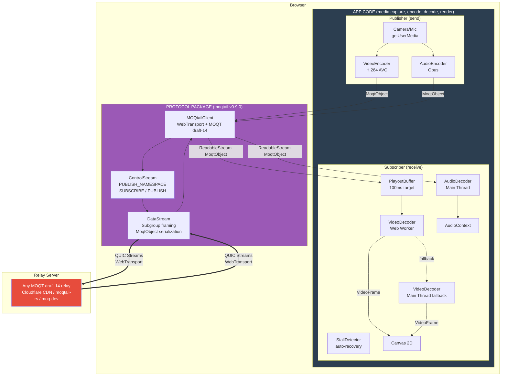
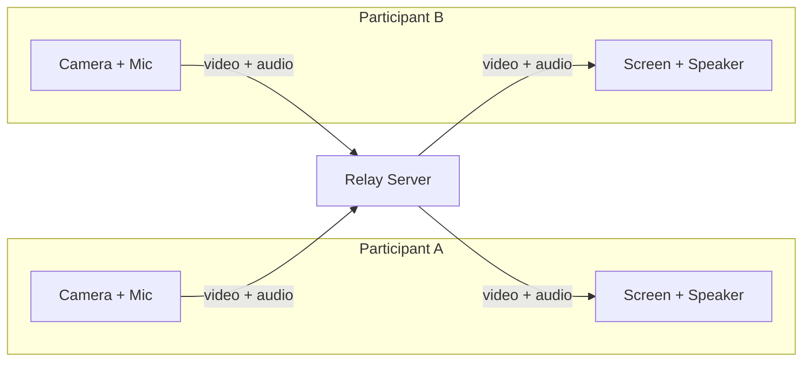
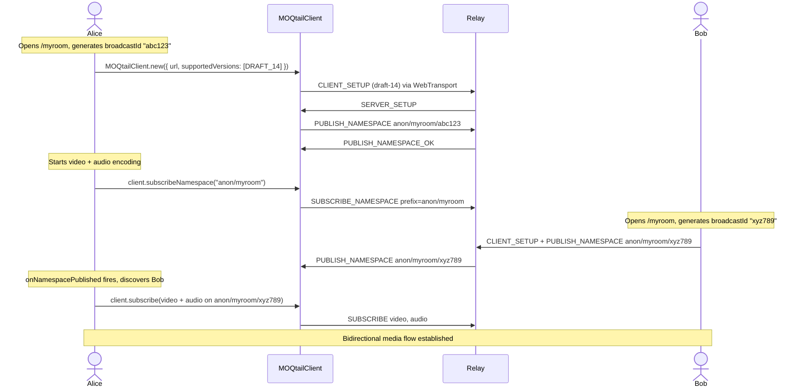
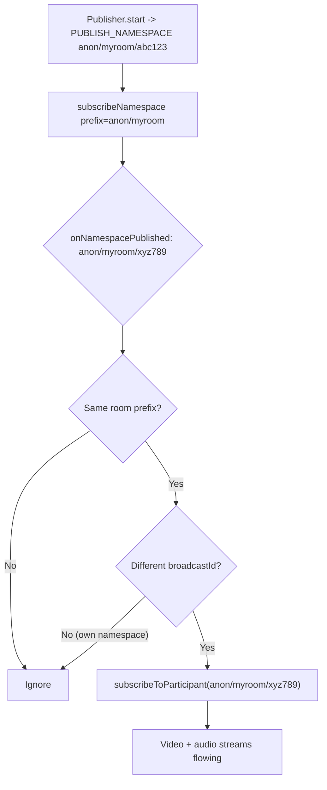
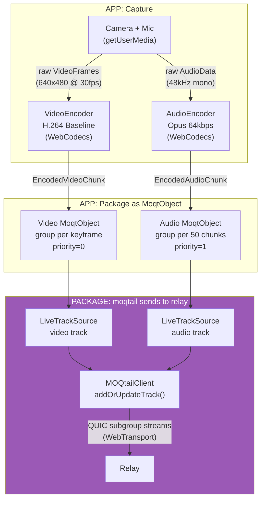
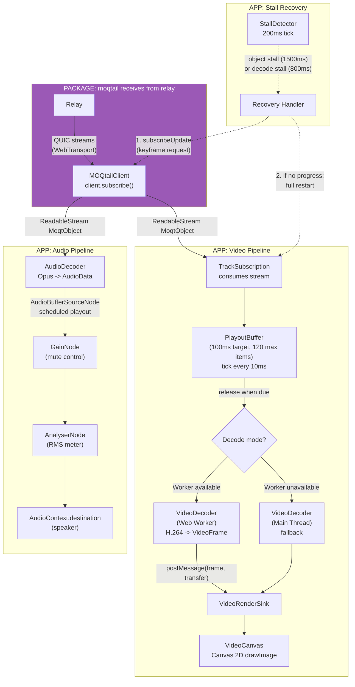
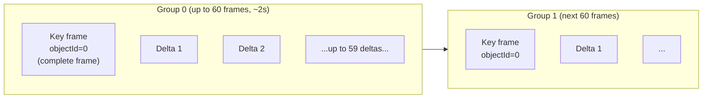
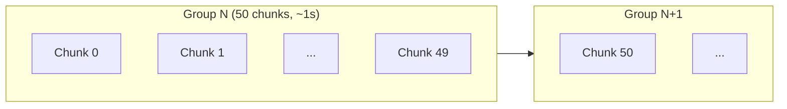
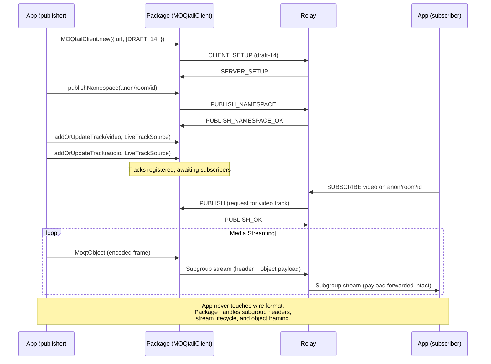

# moq-test5-moqtail

## Architecture

There are two distinct layers in this project: **app code** (media capture, encoding, decoding, rendering) and a **protocol package** (`moqtail` npm) that handles all MOQT wire format, control messages, and WebTransport session management. The app never touches the protocol — it only sends and receives `MoqtObject`s.



### How it works

1. **App code (publisher)** captures camera/mic via `getUserMedia`, encodes with WebCodecs (H.264 + Opus), wraps each encoded chunk as a `MoqtObject`
2. **Protocol package** (`moqtail`) takes those `MoqtObject`s and handles everything else: WebTransport session, MOQT handshake, `PUBLISH_NAMESPACE`, subgroup framing, QUIC stream management
3. **Relay** receives published tracks and fans out to all subscribers. Compatible with any draft-14 relay (Cloudflare CDN, moqtail-rs, moq-dev)
4. **Protocol package** receives QUIC streams from the relay, parses them, and delivers a `ReadableStream<MoqtObject>` back to the app
5. **App code (subscriber)** takes those `MoqtObject`s, buffers them, decodes with WebCodecs, and renders to canvas + AudioContext

## Comparison with test2 (facebook-encoder)

The key difference is **what lives where**. A protocol package handles MOQT session management, control messages, and stream framing. Everything else (media capture, encoding, decoding, rendering, workers) is app-level code regardless of which approach you use.

In test2, protocol and media code are mixed together in workers. In test5, they are cleanly separated: the `moqtail` package owns all protocol work, the app only deals with media.

| Aspect | Layer | test2 (facebook-encoder) | test5 (moqtail) |
|--------|-------|--------------------------|-----------------|
| **MOQT session setup** | protocol | Hand-written in `moqt.js` (~800 lines): CLIENT_SETUP, SERVER_SETUP, version negotiation | `moqtail` package: `MOQtailClient.new({ url, supportedVersions })` |
| **Control messages** | protocol | Hand-written: PUBLISH, SUBSCRIBE, PUBLISH_NAMESPACE parsing and serialization in `moqt.js` | `moqtail` package: `client.subscribe()`, `client.publishNamespace()`, etc. |
| **Subgroup framing** | protocol | Hand-written in `moqt.js`: subgroup header `0x14`, varint encoding, object framing | `moqtail` package: handled internally, app never sees wire format |
| **MOQMI extensions** | protocol | Hand-written in `mi_packager.js`: extension headers embedded in subgroup objects | Not used — `moqtail` uses standard MOQT objects without custom extensions |
| **Stream management** | protocol | Hand-written in `moq_sender.js`: opens/closes QUIC unidirectional streams manually | `moqtail` package: stream lifecycle managed internally |
| **Wire format code** | protocol | ~2000 lines across `moqt.js` + `mi_packager.js` + `moq_sender.js` + `moq_demuxer_downloader.js` | 0 lines — all in `moqtail` npm package |
| | | | |
| **Video capture** | app | Worker: `v_capture.js` reads camera frames | App: `getUserMedia` on main thread |
| **Audio capture** | app | Worker: `a_capture.js` reads mic samples | App: `getUserMedia` on main thread |
| **Video encoding** | app | Worker: `v_encoder.js` (H.264 via WebCodecs) | App: `VideoEncoder` on main thread |
| **Audio encoding** | app | Worker: `a_encoder.js` (Opus via WebCodecs) | App: `AudioEncoder` on main thread |
| **Video decoding** | app | Main thread: `VideoDecoder` | App: Web Worker with main-thread fallback |
| **Audio decoding** | app | Worker: `audio_decoder.js` | App: `AudioDecoder` on main thread |
| **Audio playback** | app | `SharedArrayBuffer` circular buffer + `AudioWorklet` | App: `AudioBufferSourceNode` with scheduled playout |
| **Buffering** | app | 300ms jitter buffer per track (custom `jitter_buffer.js`) | App: `PlayoutBuffer` with 100ms target latency |
| **Stall recovery** | app | None — user must refresh the page | App: `StallDetector` with auto keyframe request + restart |
| **Participant discovery** | app | `localStorage` shared broadcastId or URL room name | App: `subscribeNamespace` prefix matching via relay announcements |
| **Connection model** | app | Separate WebTransport sessions for encoder and player | App: single `MOQtailClient` for both publish and subscribe |

**Summary**: If you extracted test2's protocol code into a package, you'd end up with the same split that test5 already has — the workers would stay in the app for media processing, and the protocol logic would move into the package. The `moqtail` package is essentially that extraction already done for you.

## Room / Video Call



Each participant publishes their media to the relay and subscribes to the other's streams. The relay forwards without decoding or processing the media content.

### Join sequence



### Participant discovery

Each participant publishes under a unique namespace:

```
anon/{roomName}/{broadcastId}
```

The app calls `subscribeNamespace` with prefix `anon/{roomName}`. When the relay forwards a `PUBLISH_NAMESPACE` announcement from another participant, the `onNamespacePublished` callback fires and the subscriber auto-subscribes to their video and audio tracks.



## Media pipeline

### Encoder pipeline (send)



1. **Capture** (app) -- `getUserMedia` provides raw video frames and audio samples on the main thread.

2. **Encode** (app) -- WebCodecs compresses the raw media:
   - **Video**: H.264 Baseline (`avc1.42001f`), 640x480 @ 30fps, 1 Mbps, `annexb` format. Key frames forced every 60 frames (~2s). Each keyframe starts a new MOQT group.
   - **Audio**: Opus at 64kbps, 48kHz mono. Chunks are grouped into batches of 50 (~1 second per group).

3. **Package** (app) -- Each encoded chunk is wrapped in a `MoqtObject` with location (group, object), priority, and forwarding preference (`Subgroup`). Video gets priority 0 (highest), audio gets priority 1.

4. **Send** (package) -- The `LiveTrackSource` wraps the `ReadableStream<MoqtObject>` and is registered with `client.addOrUpdateTrack()`. The moqtail library handles subgroup framing and QUIC stream management automatically.

### Subscriber pipeline (receive)



4. **Receive** (package) -- `client.subscribe()` returns a `ReadableStream<MoqtObject>` with objects already parsed from QUIC streams. No manual wire-format parsing needed.

5. **Playout buffer** (app) -- Video objects enter a `PlayoutBuffer` (100ms target latency, max 120 items, 10ms tick). Objects are sorted by location (group, object) and released when their scheduled playout time arrives. Overflow drops oldest objects; late arrivals (already-released locations) are rejected.

6. **Decode** (app) -- WebCodecs decompresses the media:
   - Video: First attempts `VideoDecoder` in a dedicated Web Worker. If the worker fails to initialize (e.g., `VideoDecoder` not available in worker context), falls back to main-thread decoder. Decoded `VideoFrame`s are transferred back via `postMessage` with `Transferable`.
   - Audio: `AudioDecoder` on main thread. Decoded `AudioData` is converted to `AudioBuffer` and played via scheduled `AudioBufferSourceNode` with 50ms initial delay.

7. **Render** (app) -- Decoded frames are presented:
   - Video: drawn to a `<canvas>` element via `ctx.drawImage(frame)`. Local preview is horizontally flipped.
   - Audio: Routed through `GainNode` (speaker mute control) -> `AnalyserNode` (RMS metering) -> `AudioContext.destination`.

8. **Stall detection and recovery** (app) -- A `StallDetector` checks every 200ms for:
   - **Object stall** (1500ms no new objects): likely network issue -> request keyframe, then restart subscription
   - **Decode stall** (800ms no decoded frames while objects are arriving): likely decoder stuck -> reset decoder, request keyframe via `subscribeUpdate`, wait 1s for progress, then restart if no improvement
   - Rate-limited: max 3 recoveries per 30s window, minimum 3s between attempts

## Video key frames and grouping



- **Key frames** are forced every 60 frames (~2s at 30fps). Each starts a new MOQT group (`groupId++`, `objectId=0`).
- **Delta frames** increment `objectId` within the current group.
- The `PlayoutBuffer` treats `objectId === 0` as a key frame for decode ordering.

## Audio grouping



- Opus produces chunks at ~20ms intervals.
- Every 50 chunks (~1 second), `groupId` increments and `objectId` resets.
- All audio chunks are encoded as key frames (Opus is inherently a low-delay codec).

## Wire format



## File structure

```
src/                                    All app code (no protocol code here)
  App.tsx                               SolidJS router (single route -> Test5)
  pages/Test5.tsx                       Main page: wires publisher + subscriber + UI
  scenarios/
    MoqtailPublisher.ts                 Camera/mic capture -> WebCodecs encode -> moqtail publish
    MoqtailSubscriber.ts                Namespace discovery -> subscribe -> decode -> render
  media/subscriber/
    SubscriberEngine.ts                 Manages TrackSubscription lifecycle
    TrackSubscription.ts                Per-track: subscribe, playout buffer, decode, stall recovery
    PlayoutBuffer.ts                    Time-based release queue with overflow/late drop
    StallDetector.ts                    Periodic health check with auto-recovery triggers
    types.ts                            FrameObject, DecodedFrame, Worker message types
  workers/
    subscriberVideoDecodeWorker.ts      Dedicated VideoDecoder in Web Worker
  hooks/useTestSession.ts               Room state, relay URL, join/leave lifecycle
  components/
    TestShell.tsx                        Layout wrapper
    TestControls.tsx                     Relay URL, room name, join/leave controls
  VideoCanvas.tsx                       Canvas renderer for VideoFrame
  DebugPanel.tsx                        Diagnostics: connection status, RMS, event log
  helpers.ts                            URL normalization, relay URL persistence
  types.ts                              DiagEvent, RemoteParticipant interfaces

node_modules/moqtail/                   Protocol package (all protocol code lives here)
  MOQtailClient                         WebTransport session + MOQT handshake
  ControlStream                         Bidirectional control message stream
  DataStream                            Unidirectional data streams (subgroup framing)
  Message Handlers                      publish_namespace, subscribe, fetch, unsubscribe, ...
  Track + LiveTrackSource               Track registration and live content delivery
  Protocol Model                        ClientSetup, ServerSetup, MoqtObject, FullTrackName, Tuple, Location, ...
```
