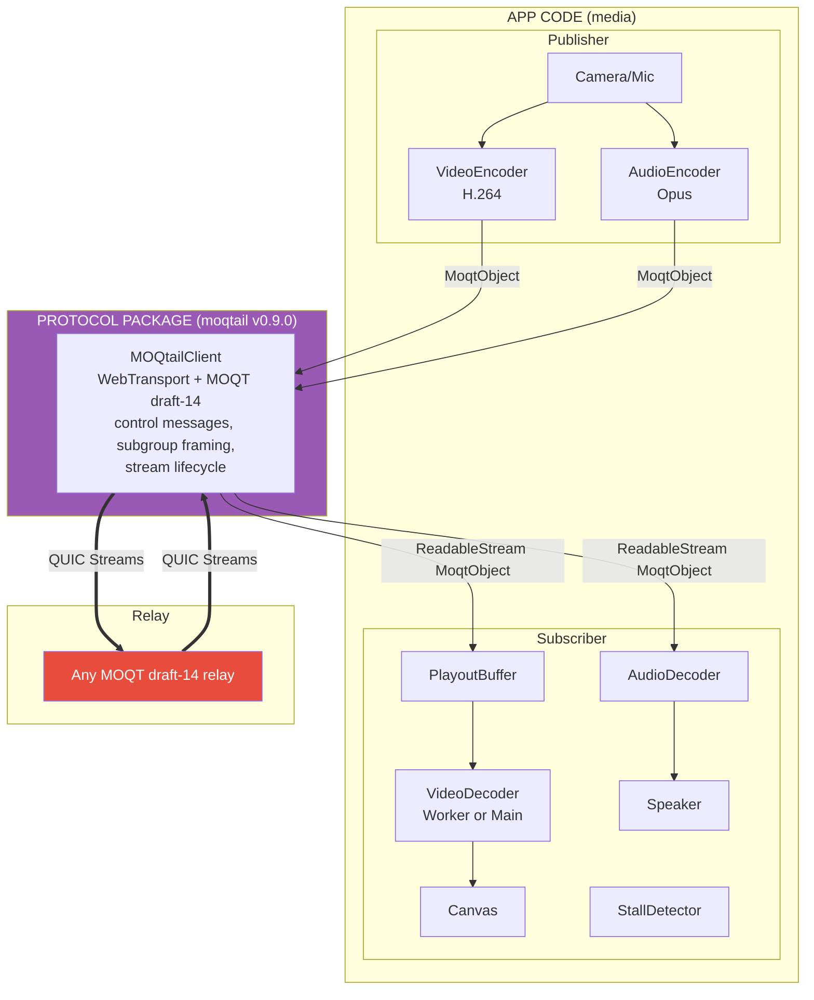
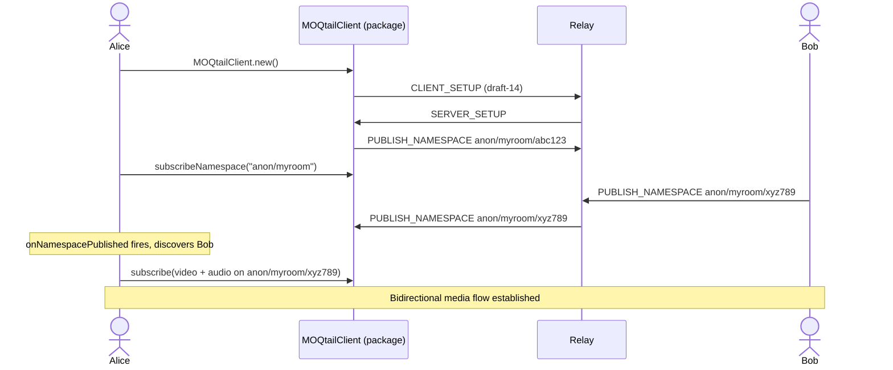

# moq-test5-moqtail

## Architecture

There are two distinct layers: **app code** (media capture, encoding, decoding, rendering) and a **protocol package** (`moqtail` npm) that handles all MOQT wire format, control messages, and WebTransport. The app never touches the protocol — it only sends and receives `MoqtObject`s.



### How it works

1. **App (publisher)** captures camera/mic, encodes with WebCodecs (H.264 + Opus), wraps each chunk as a `MoqtObject`
2. **Package** (`moqtail`) takes those objects and handles everything else: WebTransport session, MOQT handshake, `PUBLISH_NAMESPACE`, subgroup framing, QUIC streams
3. **Relay** receives published tracks and fans out to subscribers
4. **Package** receives QUIC streams, parses them, delivers `ReadableStream<MoqtObject>` back to the app
5. **App (subscriber)** buffers, decodes, and renders. StallDetector auto-recovers from freezes

## Comparison with test2 (facebook-encoder)

The key difference is **what lives where**. A protocol package handles MOQT session management, control messages, and stream framing. Everything else (media capture, encoding, decoding, rendering, workers) is app-level code regardless of which approach you use.

In test2, protocol and media code are mixed together in workers. In test5, they are cleanly separated.

| Aspect | Layer | test2 (facebook-encoder) | test5 (moqtail) |
|--------|-------|--------------------------|-----------------|
| **MOQT session setup** | protocol | Hand-written in `moqt.js`: CLIENT_SETUP, SERVER_SETUP, version negotiation | `moqtail` package: `MOQtailClient.new()` |
| **Control messages** | protocol | Hand-written: PUBLISH, SUBSCRIBE, PUBLISH_NAMESPACE parsing in `moqt.js` | `moqtail` package: `client.subscribe()`, `client.publishNamespace()` |
| **Subgroup framing** | protocol | Hand-written: header `0x14`, varint encoding, object framing | `moqtail` package: handled internally |
| **MOQMI extensions** | protocol | Hand-written in `mi_packager.js` | Not used — standard MOQT objects |
| **Stream management** | protocol | Hand-written in `moq_sender.js`: opens/closes QUIC streams manually | `moqtail` package: managed internally |
| **Protocol code total** | protocol | ~2000 lines (moqt.js + mi_packager.js + moq_sender.js + moq_demuxer_downloader.js) | 0 lines — all in npm package |
| | | | |
| **Video capture + encode** | app | Workers: `v_capture.js` + `v_encoder.js` | Main thread: `VideoEncoder` |
| **Audio capture + encode** | app | Workers: `a_capture.js` + `a_encoder.js` | Main thread: `AudioEncoder` |
| **Video decoding** | app | Main thread: `VideoDecoder` | Web Worker with main-thread fallback |
| **Audio decoding** | app | Worker: `audio_decoder.js` | Main thread: `AudioDecoder` |
| **Audio playback** | app | `SharedArrayBuffer` + `AudioWorklet` | `AudioBufferSourceNode` scheduled playout |
| **Buffering** | app | 300ms jitter buffer (`jitter_buffer.js`) | `PlayoutBuffer` 100ms target latency |
| **Stall recovery** | app | None — user must refresh | `StallDetector` with auto keyframe request + restart |
| **Participant discovery** | app | `localStorage` or URL room name | `subscribeNamespace` via relay announcements |

**Summary**: If you extracted test2's protocol code into a package, you'd end up with the same split that test5 already has — workers stay in the app for media, protocol moves into the package.

## Room — Video Call

Two participants join the same room, each publishes camera/mic. The system discovers remote participants via relay namespace announcements.



Each participant publishes under namespace `anon/{roomName}/{broadcastId}`. The app calls `subscribeNamespace` with prefix `anon/{roomName}`. When the relay forwards a `PUBLISH_NAMESPACE` from another participant, `onNamespacePublished` fires and the app auto-subscribes.

### Media pipeline details

**Encoder pipeline (send)** — all app code:
1. **Capture** — `getUserMedia` provides raw video (640x480 @ 30fps) and audio (48kHz mono)
2. **Encode** — H.264 Baseline (`avc1.42001f`), 1 Mbps, keyframe every 60 frames (~2s). Opus 64kbps.
3. **Package** — Each chunk becomes a `MoqtObject` with location (group, object) and priority. Video priority=0, audio priority=1.
4. **Send** — `LiveTrackSource` + `client.addOrUpdateTrack()`. The package handles QUIC streams.

**Subscriber pipeline (receive)** — all app code except step 4:
4. **Receive** (package) — `client.subscribe()` returns `ReadableStream<MoqtObject>` already parsed
5. **Buffer** — `PlayoutBuffer` (100ms target, 120 max items, 10ms tick). Sorted by location, released on schedule.
6. **Decode** — Video: Web Worker `VideoDecoder`, falls back to main thread. Audio: main thread `AudioDecoder`.
7. **Render** — Video to `<canvas>`. Audio through `GainNode` + `AnalyserNode` (RMS) to speaker.
8. **Recovery** — `StallDetector` checks every 200ms. Object stall (1500ms) or decode stall (800ms) triggers keyframe request via `subscribeUpdate`, then full restart if no progress. Max 3 recoveries per 30s.

### Grouping

- **Video**: Keyframe every 60 frames (~2s at 30fps) starts a new MOQT group. Delta frames increment objectId.
- **Audio**: 50 Opus chunks (~1s) per group. All chunks are keyframes (Opus is inherently low-delay).

## File structure

```
src/                                    All app code (no protocol code)
  scenarios/
    MoqtailPublisher.ts                 Capture + encode + publish via moqtail
    MoqtailSubscriber.ts                Discover + subscribe + decode + render
  media/subscriber/
    TrackSubscription.ts                Per-track: subscribe, buffer, decode, stall recovery
    PlayoutBuffer.ts                    Time-based release queue
    StallDetector.ts                    Health check with auto-recovery
    SubscriberEngine.ts                 Manages TrackSubscription lifecycle
  workers/
    subscriberVideoDecodeWorker.ts      VideoDecoder in Web Worker
  pages/Test5.tsx                       Main page UI
  hooks/useTestSession.ts               Room state, join/leave lifecycle

node_modules/moqtail/                   Protocol package (all protocol code)
  MOQtailClient                         WebTransport + MOQT session
  ControlStream / DataStream            Wire format, stream lifecycle
  Track + LiveTrackSource               Track registration
  Protocol Model                        MoqtObject, FullTrackName, Tuple, Location, ...
```
